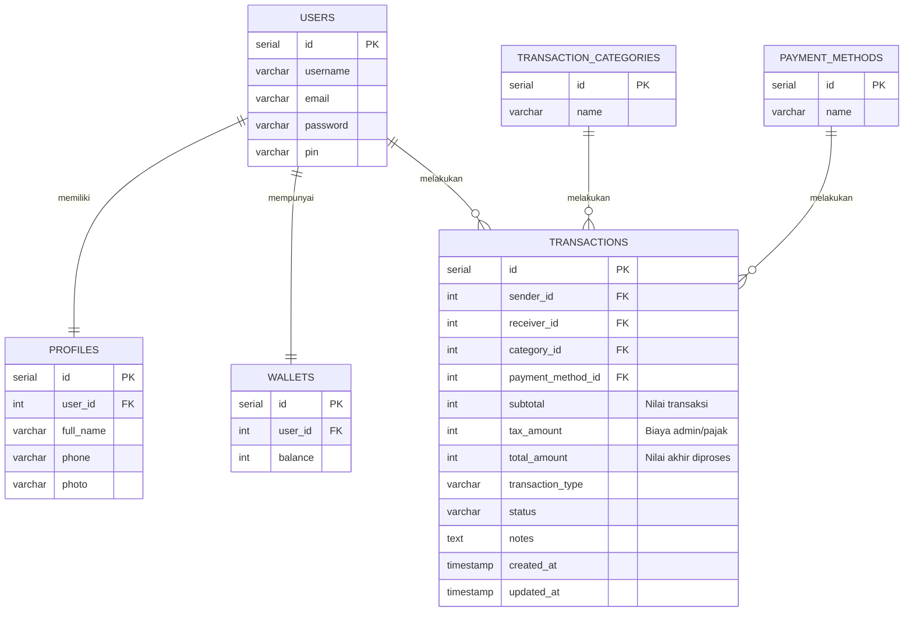

```mermaid
erDiagram
    USERS ||--|| PROFILES : "memiliki"
    USERS ||--|| WALLETS : "mempunyai"
    USERS ||--o{ TRANSACTIONS : "melakukan"
    TRANSACTION_CATEGORIES ||--o{ TRANSACTIONS : "melakukan"
    PAYMENT_METHODS ||--o{ TRANSACTIONS : "melakukan"

    USERS {
        serial id PK
        varchar username
        varchar email
        varchar password
        varchar pin
    }

    PROFILES {
        serial id PK
        int user_id FK
        varchar full_name
        varchar phone
        varchar photo
    }

    WALLETS {
        serial id PK
        int user_id FK
        int balance
    }

    TRANSACTION_CATEGORIES {
        serial id PK
        varchar name
    }

    PAYMENT_METHODS {
        serial id PK
        varchar name
    }

    TRANSACTIONS {
        serial id PK
        int sender_id FK
        int receiver_id FK
        int category_id FK
        int payment_method_id FK
        int subtotal "Nilai transaksi"
        int tax_amount "Biaya admin/pajak"
        int total_amount "Nilai akhir diproses"
        varchar transaction_type
        varchar status
        text notes
        timestamp created_at
        timestamp updated_at
    }

```