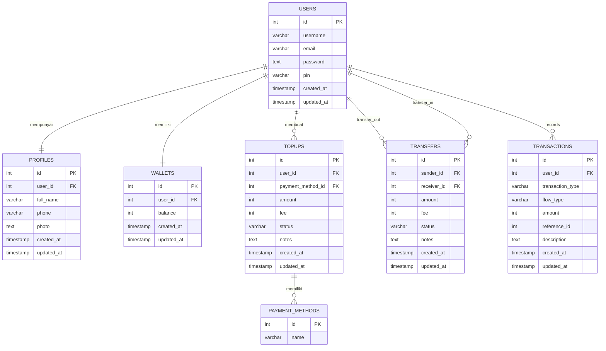

```mermaid
erDiagram
    USERS {
        int id PK
        varchar username 
        varchar email 
        text password
        varchar pin
        timestamp created_at
        timestamp updated_at
    }

    PROFILES {
        int id PK
        int user_id FK
        varchar full_name
        varchar phone
        text photo
        timestamp created_at
        timestamp updated_at
    }

    WALLETS {
        int id PK
        int user_id FK
        int balance
        timestamp created_at
        timestamp updated_at
    }

    PAYMENT_METHODS {
        int id PK
        varchar name 
    }

    TOPUPS {
        int id PK
        int user_id FK
        int payment_method_id FK
        int amount
        int fee
        varchar status
        text notes
        timestamp created_at
        timestamp updated_at
    }

    TRANSFERS {
        int id PK
        int sender_id FK
        int receiver_id FK
        int amount
        int fee
        varchar status
        text notes
        timestamp created_at
        timestamp updated_at
    }

    TRANSACTIONS {
        int id PK
        int user_id FK
        varchar transaction_type
        varchar flow_type
        int amount
        int reference_id
        text description
        timestamp created_at
        timestamp updated_at
    }

    USERS ||--|| PROFILES : mempunyai
    USERS ||--|| WALLETS : memiliki

    USERS ||--o{ TOPUPS : membuat
    TOPUPS ||--o{ PAYMENT_METHODS : memiliki
    
    USERS ||--o{ TRANSFERS : transfer_out
    USERS ||--o{ TRANSFERS : transfer_in
    
    USERS ||--o{ TRANSACTIONS : records
```